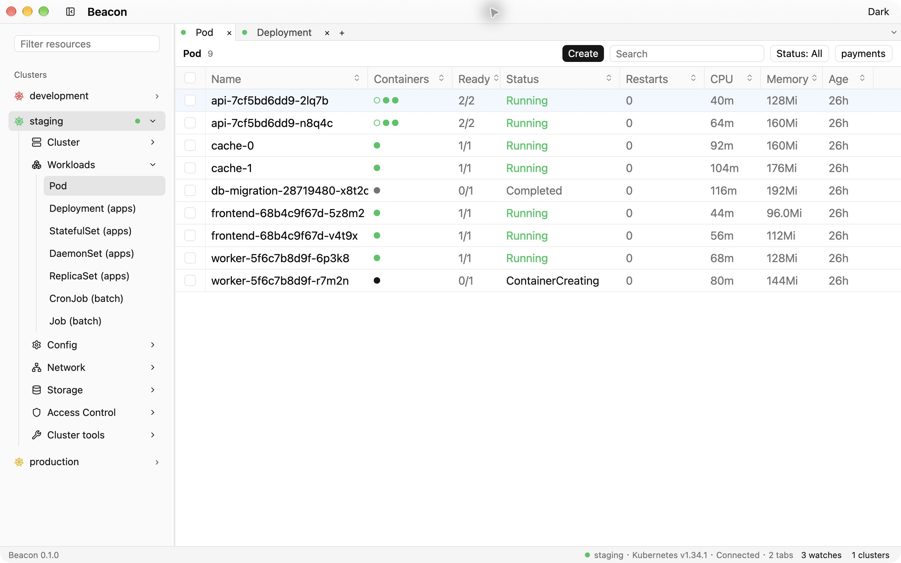

<p align="center">
  
</p>

<h1 align="center">Beacon</h1>

<p align="center">
  <strong>English</strong> · <a href="README.zh-CN.md">简体中文</a>
</p>

<p align="center">
  <strong>A native Kubernetes desktop client</strong><br>
  Multiple clusters · Live resource views · Pod terminals · Custom themes
</p>

<p align="center">
  <a href="https://github.com/yoogoc/beacon/actions/workflows/ci.yml"></a>
  
  
  <a href="Cargo.toml"></a>
</p>

<p align="center">
  <a href="#quick-start">Quick start</a> ·
  <a href="docs/USAGE.md">User guide (中文)</a> ·
  <a href="https://github.com/yoogoc/beacon/releases">Downloads</a> ·
  <a href="docs/DEVELOPMENT.md">Developer guide (中文)</a>
</p>

<p align="center">
  <picture>
    <source media="(prefers-color-scheme: dark)" srcset="docs/images/workspace-dark.jpg">
    <source media="(prefers-color-scheme: light)" srcset="docs/images/workspace-light.jpg">
    
  </picture>
</p>

<p align="center">
  <sub>Actual macOS screenshots with local demo data; the image follows your browser's color preference.</sub>
</p>

Built with Rust and GPUI, Beacon brings clusters, resource lists, details, and container tools into one desktop workspace.
It uses your existing kubeconfig and cluster permissions, discovering both built-in resources and CRDs from the cluster without additional plugins.

## Features

| Feature | What you can do |
| --- | --- |
| **Cluster workspace** | Switch contexts from the sidebar and keep multiple clusters connected. Recognize EKS names, set aliases and custom icons, disconnect, and reconnect. |
| **Resources and CRDs** | Follow live Watch updates, use kubectl-style columns for built-in resources, and read CRD `additionalPrinterColumns` dynamically. |
| **Nodes** | See taint counts, hover to inspect each taint, and view EKS node group membership. |
| **Search and filters** | Fuzzy search, sorting, and namespace multi-select. Filter Pod / Deployment status, Service type, Ingress class, PVC attributes, Secret type, and CRD scope. |
| **Personalized lists** | Choose visible columns, drag headers to reorder, and resize columns. Layout and sorting save per cluster and resource type; name and reuse filter combinations. |
| **Related resources** | Navigate from Deployments to ReplicaSets and Pods, Services to EndpointSlices and Pods, and PVCs to their consuming Pods in a live Related detail tab. |
| **Resource details** | Overview, YAML, and Events; selectable values; collapsible labels and annotations; container ports, requests and limits, probes, environment, and mounts; clickable owner links. |
| **Argo Workflows** | Dedicated resource group, Workflow and template graphs, CronWorkflow run history, and separate node details with Pod containers, inputs, outputs, artifacts, and YAML. Controller resources stay collapsed in the sidebar. |
| **Pod tools** | Logs with keyword search and highlighting, pause / resume follow, jump to latest, word wrap, container selection, and download. Run commands, open Shell, and forward ports in a separate bottom panel. Filled / hollow markers show regular / init container states. |
| **Aggregated logs** | Follow Pods selected by a workload or label, with Pod / container prefixes and timestamps. New replicas join automatically; search, pause, wrap, and download separate log files to a chosen folder. |
| **Deployment history** | Inspect retained revisions, images, and creation times; review a template diff before rolling back and follow rollout progress. |
| **Debug containers** | Add an ephemeral container to a running Pod, choose its image, target container, and security profile, then open its terminal. |
| **Network paths** | Explore Ingress → Service → EndpointSlice → Pod relationships, inspect missing references, readiness, and port mismatches, and navigate between resources. |
| **Resource comparison** | Compare resources across connected clusters or namespaces in a read-only YAML diff, excluding runtime fields by default and concealing Secret values. |
| **Resource operations** | Create YAML resources with server validation, review a YAML diff before creating or applying changes, restart, scale, and delete individually or in bulk. Row action menus share resource-specific operations and permission checks with right-click menus. |
| **ConfigMaps and Secrets** | View and edit data by key. Secret values start concealed. Inspect TLS certificate subjects, issuers, validity, algorithms, key strength, extensions, and public keys. |
| **Metrics and Helm** | Read Pod / Node CPU and memory from the Kubernetes Metrics API or Prometheus, and inspect Helm releases stored in the cluster. |
| **Updates** | Automatic checks, optional automatic downloads, signed packages, Stable / Development channels, and restart confirmation that protects unapplied edits. |
| **Appearance and connections** | Light, dark, and named custom themes; locally saved fonts and colors; global and per-cluster proxies. |
| **Diagnostics and keyboard navigation** | Command palette, searchable shortcut guide, separate application log window, and connection / Watch inspection from the status bar. |

## Quick start

### Download a build

Check [Releases](https://github.com/yoogoc/beacon/releases) for available platform artifacts.
Pushes to `main` do not automatically build or publish packages.
Formal `vX.Y.Z` tags must match the Cargo version and publish a Release marked as
**Latest** after all platform packages succeed. See the [release procedure (中文)](docs/PACKAGING.md#版本规则与正式发版).
Manually triggered packaging runs publish artifacts in
[Actions](https://github.com/yoogoc/beacon/actions/workflows/package.yml).

| Platform | Package formats | Verification |
| --- | --- | --- |
| macOS · Apple Silicon / Intel | `.app`, `.dmg` | Building, packaging, and launch verified locally; signing and notarization remain unverified. |
| Linux · x86_64 / ARM64 | `.deb`, AppImage | Packaging jobs configured; not yet verified locally. |
| Windows · x86_64 / ARM64 | NSIS installer | Packaging jobs configured; not yet verified locally. |

Available artifacts depend on Release and Actions results. See [Packaging and distribution (中文)](docs/PACKAGING.md) for details.

### Run from source

Install the Rust toolchain and platform build dependencies. The repository pins Rust 1.98 in `rust-toolchain.toml`.
macOS requires Xcode Command Line Tools. Linux system dependencies and the Windows MSVC environment are described in the
[developer guide (中文)](docs/DEVELOPMENT.md).

```sh
git clone https://github.com/yoogoc/beacon.git
cd beacon
cargo run --locked
```

Beacon reads `KUBECONFIG`, falling back to `~/.kube/config`. To select a configuration:

```sh
KUBECONFIG=/path/to/kubeconfig cargo run --locked
```

On your first launch:

1. Click a cluster name in the sidebar to connect.
2. Expand a resource group and select Pods, Deployments, or another resource type.
3. Click a resource to inspect its details, or right-click for available actions.

**Beacon starts without connecting to a cluster and opens no resource list until you select one.**
Kubeconfig credential helpers must be available on PATH. If a cluster rejects WebSocket Exec upgrades,
Shell / Exec can automatically fall back to a locally installed `kubectl`.

## Workspace and shortcuts

Selecting a resource type reuses a tab for the **same cluster and resource type** in the focused pane. Right-click and choose **Open in new tab** for another view.
Each tab keeps its own namespace, search, filters, and details. The sidebar sits outside the tabs; drag the dividers to resize the sidebar, right-side details, and bottom Pod panel.

Right-click a tab to split right or down, or move it to a separate window. Splits can be nested and resized.
Drag tabs between groups or windows to merge them; drop near a pane's edge to create a split.
Moving a tab preserves its view, YAML draft, and Pod tools. Windows share cluster connections and Watches.

| Action | macOS | Windows / Linux |
| --- | --- | --- |
| Command palette | `⌘ K` | `Ctrl K` |
| New / close tab | `⌘ T` / `⌘ W` | `Ctrl T` / `Ctrl W` |
| Next / previous tab | `Ctrl Tab` / `Ctrl Shift Tab` | `Ctrl Tab` / `Ctrl Shift Tab` |
| Split right / down | `⌘ ⌥ →` / `⌘ ⌥ ↓` | `Ctrl Alt →` / `Ctrl Alt ↓` |
| Application settings | `⌘ ,` | `Ctrl ,` |
| Application logs | `⌘ Shift L` | `Ctrl Shift L` |
| Shortcut guide | `F1` | `F1` |

The command palette accepts `@resource-type`, `#namespace`, `ctx cluster`, and `>command`.
For example, `@dep` finds Deployment and `#kube-sys` finds kube-system.
Open **Help → Keyboard shortcuts** for the full shortcut list and focus behavior.

## Make it yours

**Application settings:** use **Beacon → Settings…** in the macOS menu bar, or **Menu → Settings…** on Windows / Linux.
Choose a theme, adjust fonts and text / button colors, save multiple local themes, and configure a global HTTP, HTTPS, or SOCKS5 proxy.

**Updates:** open **Settings → Updates** or **Check for updates…** in the application menu. Installation always asks before restarting. Linux `.deb` builds provide a package download for manual installation.

**Cluster settings:** right-click a cluster and open **Cluster settings…**.
Set an alias, choose a preset or imported SVG icon, configure a separate proxy, and select Kubernetes Metrics API / Prometheus / Disabled as the metrics source.
Prometheus supports a bearer token and four editable queries, with a test action before saving.

Cluster proxies override the global proxy. **Save and reconnect** applies connection changes while preserving resource tabs.
Configuration paths, proxy behavior, and Prometheus label requirements are covered in the [configuration guide (中文)](docs/USAGE.md#应用与集群配置).

## Development

Beacon uses GPUI Fast through a pinned GPUI Kit commit after 0.7.1. Automatic
view retention is disabled by default to avoid a paint-cache overflow in GPUI
Fast 0.1.5; layout and text optimizations remain enabled. YAML highlighting and
initial field folding remain enabled. See the [development guide (中文)](docs/DEVELOPMENT.md#依赖与打包)
for dependency pins, patch tests, and rendering diagnostics.

```sh
cargo fmt --all -- --check
cargo clippy --workspace --all-targets -- -D warnings
cargo test --workspace
```

| Crate | Responsibility |
| --- | --- |
| `beacon` | Application startup, logging, and platform packaging. |
| `beacon-ui` | GPUI views, themes, resource catalog, command palette, and asynchronous bridge. |
| `beacon-kube` | Configuration, connections, discovery, Watch, permissions, and Kubernetes operations; no GPUI dependency. |
| `beacon-columns` | Built-in and CRD table columns, field formatting, and container states. |

Network tasks run on Tokio; views run on the GPUI thread. Messages carry batched updates between them.
Tabs for a cluster share its connection, and identical resource subscriptions share a Watch.

## Documentation

The detailed guides below are currently written in Chinese.

| Document | Contents |
| --- | --- |
| [User guide](docs/USAGE.md) | Tabs, namespaces, filters, details, Pod tools, resource operations, settings, and logs. |
| [Developer guide](docs/DEVELOPMENT.md) | Build dependencies, checks, headless validation, UI screenshots, and development conventions. |
| [Design notes](docs/DESIGN.md) | Initial architecture, technology choices, and milestones. |
| [Packaging and distribution](docs/PACKAGING.md) | Platform artifacts, CI releases, signing, and verification status. |

The project declares **Apache-2.0** in its Cargo metadata. See the [icon notes](crates/beacon-ui/assets/README.md) for UI icon sources and licensing.
